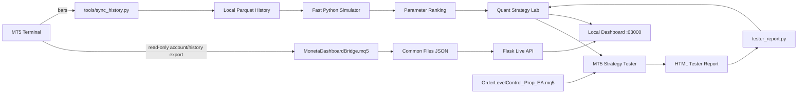

# Prop-Panel

**Local-first MT5 prop-trading risk monitor, execution toolkit, and Quant Strategy Lab.**

[](https://github.com/thecapitalland/Prop-Panel/actions/workflows/tests.yml)


Prop-Panel combines a local Flask dashboard, MQL5 components, historical market-data caching, fast parameter sweeps, and real MetaTrader 5 Strategy Tester validation in one workstation-oriented toolkit.

> **Important:** this project is decision-support and research software. It is not financial advice, it makes no profitability claim, and its prop-rule calculations are configurable approximations. The broker/prop-firm portal remains the source of truth.

## Why this exists

Prop-trading workflows usually fragment live risk monitoring, strategy research, MT5 execution logic, and backtest validation across separate tools. Prop-Panel keeps those concerns local and connected without turning the workstation into a cloud service.

Core design goals:

- Local-first operation on the MT5 workstation
- Read-only bridge path for stable live monitoring
- Explicit separation between fast simulation and real EA testing
- Configurable prop-risk metrics and guardrails
- No automatic start/stop/kill of a live MT5 terminal from the dashboard
- Testable Python metrics without requiring a live broker connection

## Core capabilities

| Area | Capability |
|---|---|
| Live Monitor | Balance, equity, floating P&L, drawdown usage, profit-target progress, trading-day metrics, positions and trade statistics |
| MT5 Bridge | Read-only MQL5 exporter for account/history/position data into a local JSON file |
| Quant Strategy Lab | Fast Python simulation and parameter sweeps across Risk / TP / SL / Gap combinations |
| Real Validation | MetaTrader 5 Strategy Tester orchestration using the actual MQL5 EA |
| History Cache | Local Parquet cache for repeatable research without repeatedly querying MT5 |
| Execution EA | Basket/order-level MQL5 EA with prop-oriented guardrails |
| Multi-terminal | Config-driven switching between local MT5 terminal installations |

## Quant Strategy Lab

The Strategy Lab deliberately separates two different forms of testing:

### Mode A — Fast Python simulation

- Runs against local `History/**/*.parquet` data
- Sweeps parameter combinations quickly
- Ranks results using deterministic metrics
- Runs in a detached subprocess so the live dashboard stays responsive
- **Does not execute the real `.mq5` strategy logic**

### Mode B — Real MT5 Strategy Tester

- Uses `OrderLevelControl_Prop_EA` through the MT5 Strategy Tester
- Generates `.ini` / `.set` run inputs
- Watches for the Strategy Tester HTML report
- Parses real tester results back into the dashboard
- Intended to validate candidates discovered in Mode A

This is a quantitative research pipeline, not an ML/LLM feature. The project intentionally avoids calling deterministic grid search "AI".

## Architecture



More detail: [`docs/architecture.md`](docs/architecture.md).

## Repository map

| Path | Purpose |
|---|---|
| `OrderLevelControl_Prop_EA.mq5` | Trading / basket EA and prop-oriented guardrails |
| `OrderLevelControl_Prop_EA.ex5` | Compiled convenience artifact matching the included source |
| `MonetaDashboardBridge.mq5` | Read-only local account/history bridge |
| `dashboard/` | Flask API, UI, metrics, Strategy Lab and tester integration |
| `tools/sync_history.py` | Local OHLC history synchronization |
| `History/` | Local market-data cache; runtime files are gitignored |
| `tester/` | MT5 `.set` / `.ini` templates and parser fixtures |
| `AGENTS.md` | Development constraints and continuation notes |

## Quick start

### 1. Install dependencies

```powershell
git clone https://github.com/thecapitalland/Prop-Panel.git
cd Prop-Panel
python -m venv .venv
.\.venv\Scripts\Activate.ps1
python -m pip install --upgrade pip
python -m pip install -r requirements.txt
```

### 2. Configure local MT5 terminals

Edit `dashboard/terminals.json` and point each `path` to the local `terminal64.exe` installation you want Prop-Panel to use.

Do not commit credentials, account exports, Telegram tokens, or generated runtime metadata.

### 3. Optional: attach the read-only bridge

Compile `MonetaDashboardBridge.mq5` in MetaEditor, attach it to a chart, and enable Algo Trading. It writes a local JSON snapshot under MetaTrader's `Common\Files` directory.

### 4. Start the dashboard

```powershell
powershell -ExecutionPolicy Bypass -File .\start_dashboard.ps1
```

Open `http://127.0.0.1:63000`.

### 5. Build the local history cache

```powershell
python tools\sync_history.py
# later incremental refresh
python tools\sync_history.py --update
```

`History/meta.json` is runtime metadata and is intentionally gitignored. A sanitized schema example is provided as `History/meta.example.json`.

## Safety model

- The Flask server binds to `127.0.0.1` by default.
- The dashboard does not automatically start, stop, or kill a live MetaTrader terminal.
- The bridge EA is read-only with respect to trading operations.
- Strategy Lab Mode A is approximate simulation, not EA-equivalent execution.
- Strategy Lab Mode B uses the actual MT5 Strategy Tester.
- `OrderLevelControl_Prop_EA.mq5` **can place/manage trades** and includes logic that can close managed positions when configured loss guards are breached.
- Prop-firm daily-loss, reset-time, consistency, and drawdown semantics differ across firms/programs; verify the configured rules independently.

## Tests

Local:

```powershell
Copy-Item History\meta.example.json History\meta.json
cd dashboard
python -m unittest test_dashboard.py test_tester_report.py -v
```

GitHub Actions runs the same core test suite on `windows-latest` so the MT5 Python dependency is exercised on its native platform.

## What this project does not claim

- No guaranteed profitability
- No broker/prop-firm certification
- No exact parity between Python simulation and MT5 fills
- No automatic verification that configured challenge rules match a firm's current legal terms
- No affiliation with or endorsement by Moneta Funded or MetaQuotes

## Roadmap

- Walk-forward validation and stronger out-of-sample analysis
- More explicit rule profiles for different challenge/funded programs
- Improved parity checks between fast simulation and real Strategy Tester results
- Better export/import of top parameter sets between Mode A and Mode B
- Expanded automated tests around prop-rule edge cases

## License

MIT. See [`LICENSE`](LICENSE).

Third-party trademarks and product names remain the property of their respective owners.