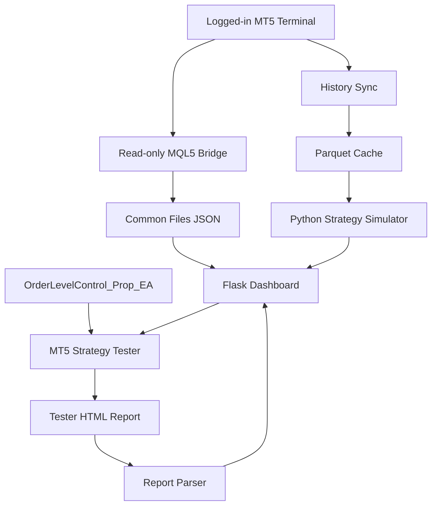

# Architecture

Prop-Panel is intentionally a workstation-oriented system rather than a distributed service.

## Data paths

## Boundaries

### Live monitoring

The preferred live path is `MonetaDashboardBridge.mq5` -> local JSON -> Flask. The bridge exports account, position, deal, and quote data but does not place trades.

### Python research path

`tools/sync_history.py` pulls local MT5 history into Parquet. `dashboard/optimizer.py` performs deterministic simulation and parameter sweeps against that cache. This path is intentionally fast and approximate.

### Real validation path

`dashboard/tester_runner.py` prepares Strategy Tester inputs and can launch a closed MT5 terminal in tester/config mode. Results are parsed by `tester_report.py` and surfaced in the same UI.

### Live execution path

`OrderLevelControl_Prop_EA.mq5` is separate from the read-only bridge and can manage real orders. Changes to this component should be treated as safety-critical.

## Process-safety decisions

- Heavy optimization runs outside the Flask request process.
- A running live MT5 terminal is not killed or transparently repurposed for Strategy Tester runs.
- The dashboard defaults to localhost.
- Runtime account metadata and market-data caches are not version-controlled.

## Trust model

Prop-Panel can calculate useful risk indicators, but challenge/funded-account rules are external policy. Broker/prop-firm portals and current program terms remain authoritative.