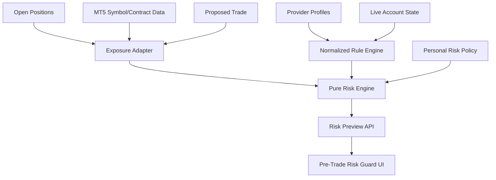

# Multi-Provider Rule Engine + Pre-Trade Risk Guard

Status: Approved design baseline
Date: 2026-10-07

## Goal

Turn Prop-Panel from a provider-specific monitoring dashboard into a provider-independent prop-trading workstation that can:

- Normalize rule profiles for Moneta Funded, SGB, and custom providers.
- Calculate current and worst-case drawdown exposure from live account state.
- Aggregate open-position stop-loss exposure.
- Preview the risk impact of a proposed trade before execution.
- Compare provider breach limits with stricter personal risk limits.
- Remain advisory/read-only by default; no automatic order blocking in this phase.

## Non-goals

- No trade signals or alpha generation.
- No automatic order placement or cancellation.
- No automatic blocking of manual trades.
- No LLM/AI recommendations.
- No cloud/SaaS architecture.
- No provider web scraping in the runtime path.

## Architecture



## Provider Profile Contract

Provider-specific data must be represented as configuration, not scattered `if provider == ...` branches.

Minimum normalized fields:

```json
{
  "id": "moneta_2step_phase1",
  "provider": "moneta_funded",
  "program": "2-step",
  "phase": 1,
  "name": "Moneta Funded 2-Step - Phase I",
  "initial_balance": 50000.0,
  "profit_target_usd": 2500.0,
  "daily_loss_limit_usd": 2500.0,
  "max_loss_limit_usd": 5000.0,
  "min_trading_days": 3,
  "min_day_profit_pct": 0.5,
  "consistency_cap_pct": 20.0,
  "daily_loss": {
    "reference": "day_start_balance",
    "includes_floating": true,
    "reset_hour_server": 0
  },
  "rules_version": "2026-10",
  "source_url": null,
  "verified_at": "2026-10-07"
}
```

Exact provider values remain independently verifiable and must not be silently inferred.

## Rule Engine

The rule layer normalizes provider-specific profiles into inputs the pure metrics/risk engine can consume.

Requirements:

- Existing dashboard behavior remains backward compatible for the current Moneta profile.
- Rule selection is explicit through `profile_id`.
- A generic/custom profile is supported.
- Provider metadata is surfaced in API payloads.
- Rules carry version/source metadata so later rule changes are auditable.

## Risk Engine

Create `dashboard/risk_engine.py` with no Flask or MetaTrader5 dependency.

Inputs:

- account balance/equity/floating P&L
- normalized provider rules
- open-position exposure expressed in USD
- proposed-trade exposure expressed in USD
- optional personal risk policy

Outputs include:

- daily and overall remaining buffer
- existing open SL exposure
- proposed trade risk
- combined worst-case loss
- projected worst-case equity
- projected daily/max usage percentages
- provider status: SAFE / WARNING / HIGH_RISK / BREACH
- personal-policy status
- safe additional risk budget

### Status thresholds

Default advisory thresholds:

- SAFE: projected usage < 70%
- WARNING: projected usage >= 70% and < 85%
- HIGH_RISK: projected usage >= 85% and < 100%
- BREACH: projected usage >= 100%

Thresholds are configurable in the personal policy and do not change provider breach math.

## Position Exposure

The existing bridge already exposes:

- symbol
- side/type
- volume
- price_open
- price_current
- stop loss
- take profit
- floating profit

MT5-specific P/L-at-SL calculation belongs in an adapter layer. The pure engine receives only USD exposure values.

Positions without a usable stop loss must not be treated as zero risk. They are marked `UNBOUNDED_RISK` and surfaced prominently.

## Proposed Trade Preview

Add:

`POST /api/risk/preview`

Input:

```json
{
  "symbol": "XAUUSD",
  "side": "BUY",
  "entry": 2671.40,
  "stop_loss": 2664.20,
  "volume": 0.50
}
```

Behavior:

- Validate symbol, side, volume, and stop.
- Calculate proposed loss in USD using MT5 symbol/contract semantics where available.
- Combine the proposed exposure with existing open SL exposure.
- Return current and projected provider/personal risk status.
- Do not execute a trade.

## Personal Risk Policy

Initial supported fields:

```json
{
  "warning_threshold_pct": 70,
  "high_risk_threshold_pct": 85,
  "personal_daily_stop_pct": 2.0,
  "max_consecutive_losses": 3,
  "max_trades_per_day": 6
}
```

Provider limits remain authoritative for provider status. Personal policy is an additional discipline layer.

## UI

Add a `Pre-Trade Risk Guard` card to the Live Monitor.

Display:

- Daily buffer
- Max-DD buffer
- Existing SL exposure
- Unbounded-risk warning count
- Proposed trade risk
- Projected worst-case daily/max usage
- Safe additional risk
- Provider status
- Personal status

Provide a lightweight `Can I Take This Trade?` form for symbol, side, entry, stop loss, and volume.

## Configuration Cleanup

- Commit `dashboard/terminals.example.json`.
- Add `dashboard/terminals.json` to `.gitignore`.
- Runtime config creation/fallback must not break existing users.
- Provider profile selection is separated from machine-specific terminal paths where practical without a broad refactor.

## Tests

Required unit coverage:

- exactly at daily breach
- one cent below/above breach
- floating profit/loss
- closed + floating loss
- multiple open positions
- position with SL
- position without SL -> unbounded risk
- provider profile switching
- personal stop below provider stop
- safe/warning/high-risk/breach proposed trade
- invalid/zero volume
- invalid/zero stop
- missing symbol/contract data
- current dashboard regression tests

## Delivery Sequence

1. Add provider profile normalization and compatibility layer.
2. Add pure risk engine + tests.
3. Add MT5 exposure adapter.
4. Add `/api/risk/preview`.
5. Add UI card/form.
6. Clean local terminal configuration.
7. Run full Windows CI.
8. Update README/CHANGELOG.

## Definition of Done

- Existing dashboard tests remain green.
- New risk-engine tests cover boundary behavior.
- Current Moneta workflow still works.
- SGB/custom profile structures can be represented without editing core risk math.
- Proposed trade preview is advisory only.
- A position with no SL is never represented as zero risk.
- CI passes on `windows-latest`.

## Safety

This feature is decision-support software. It must not claim guaranteed compliance with a provider's current rules. Provider terms and dashboards remain the source of truth, and rule profiles must expose their verification metadata.